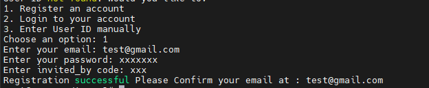
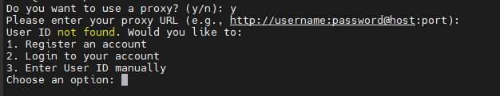

# ᝰ.ᐟ TENEO-NODE

Running Teneo Node BETA, CLI Version. <br>
Teneo Is an Browser extension Node Based. <br>


Get paid in $TENEO Tokens for simply running a node that accesses public social media data. It’s easy, passive, and you earn from the value you contribute.


## 💡 How To SignUp (Register)

- **No Need Download the Extension you can register using script**



## 🚨 Attention Before Running Teneo Cli Version

I am not `responsible` for the possibility of an account being `banned`, due to running node in the CLI, because Officially `Teneo Node Beta` does not provide an option for the CLI version, only with the Chrome extension.
but `I think` there is no reason to ban the account, because this is not cheating, I didn't change anything in the script (Heartbeats 15 minutes, maximum teneo points 25, maximum points per day 2400)

## 📎 Teneo Node cli version Script features

- Register
- Login
- Running Node
- AutoLogin
- AutoReconnect



## 📌  ScreenShot Running With Javascript/NodeJs


## ✎ᝰ. RUNNING 
- Clone Repository
```bash
git clone https://github.com/arcxteam/teneo-ai.git
cd teneo-ai
```
- Install Dependency
```bash
npm install
```
- Run the script STEP-1
```bash
node main.js
```
1. input no (if not use proxy, so this running at CLI in your server)
2. input login email and password then enter
3. close with **CTRL+C**
- Run the script STEP-2
```bash
pm2 start main.js --name teneo-ai
```
## run for multy accounts: 
- Manual put token in `tokens.txt` 1 line 1 token
    ```bash
    nano tokens.txt
    ```
- proxy (optional) in `proxies.txt`
    ```bash
    nano proxies.txt
    ```
    
### Auto get tokens: 
- fill `accounts.txt` format : `test@gmail.com|password123` 1 line 1 account
    ```bash
    nano accounts.txt
    ```
- run to get tokens
    ```bash
    node getToken.js
    ```

- Start multy accounts
    ```bash
    pm2 start multy.js --name multy-accounts
    ```
